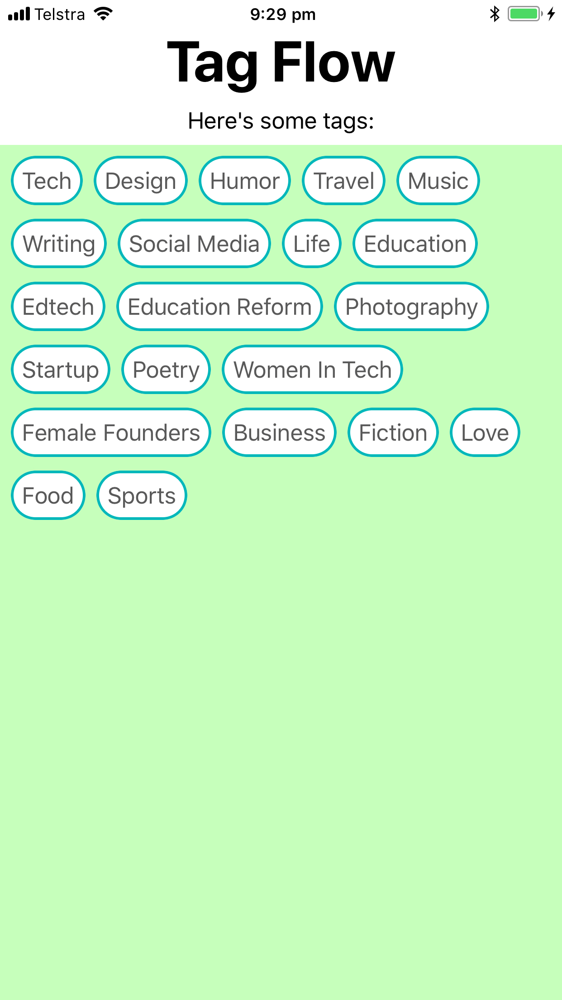

# TagFlowExample
Updated example of [making a tag view using a flow-layout](https://github.com/luceefer/TagFlowExample).

Clean Swift 4 re-implementation guided by the [original blog-post](https://codentrick.com/create-a-tag-flow-layout-with-uicollectionview/).

